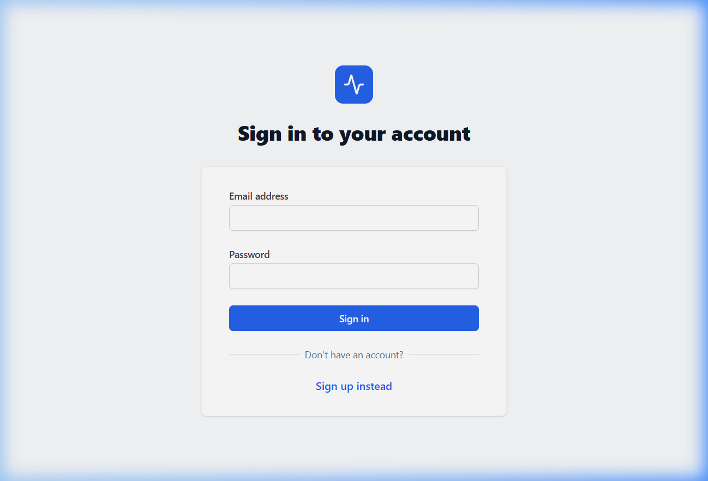
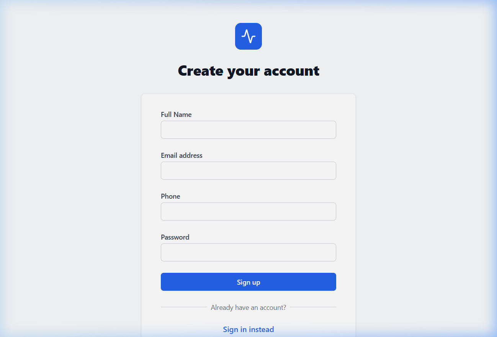
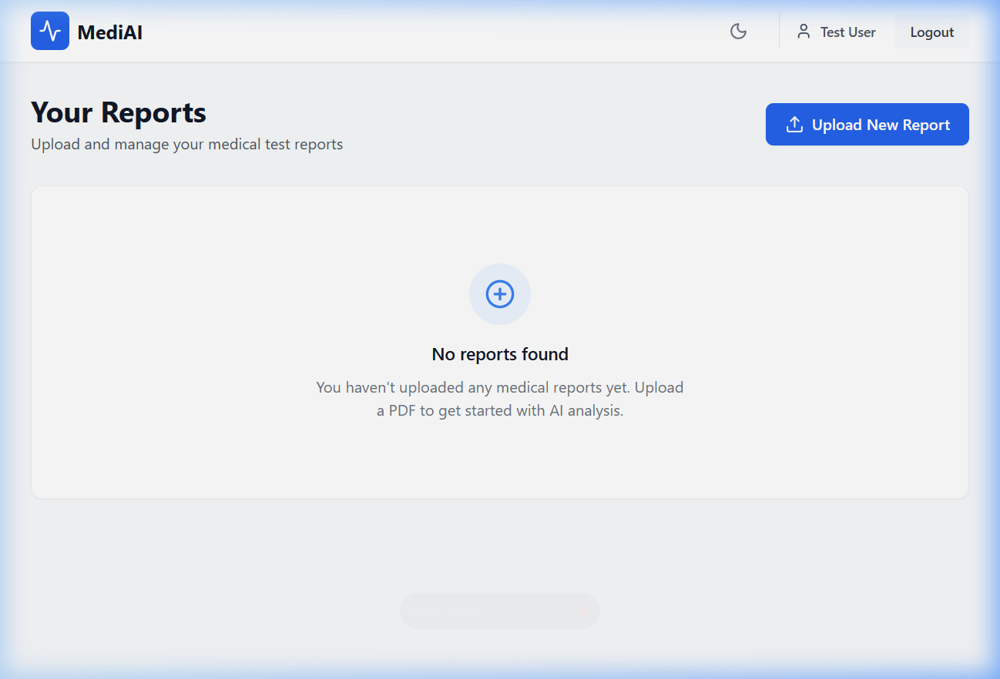

# Building a RAG-Powered Medical Report Analyzer with Groq and Llama 3.3 70B

> **"Most patients leave their doctor's office without understanding their own lab results."**  
> This project set out to change that — using open-source LLMs, a RAG architecture, and a clean full-stack implementation.

---

## Introduction

Medical reports are dense, jargon-heavy documents that most patients receive but rarely understand. A CBC (Complete Blood Count) report might flag a low hemoglobin level, but without context, a patient has no idea whether that's mildly concerning or medically urgent — let alone what questions to ask their doctor.

This article documents how I built a **Medical Report Analyzer** — a full-stack web app that:

1. Accepts a PDF medical report upload
2. Extracts and analyzes its content using **Llama 3.3 70B** via the **Groq API**
3. Summarizes findings in plain English
4. Powers an interactive **RAG (Retrieval-Augmented Generation) chatbot** that lets patients ask questions grounded strictly in their own report

The full source code is available at: [github.com/Jayasurya38/medical-ai-app](https://github.com/Jayasurya38/medical-ai-app)

---

## Why This Problem? Why Now?

LLMs have crossed a capability threshold where they can reliably:

- Parse and reason over semi-structured medical text
- Return structured JSON outputs from natural language prompts
- Stay grounded to a specific context without hallucinating (when prompted correctly)

At the same time, **Groq's inference API** now makes Llama 3.3 70B available at speeds previously only achievable with GPT-4 — with sub-second first-token latency. This changes the UX calculus entirely: a user no longer waits 30 seconds for a response. The AI feels *instant*.

The combination of fast inference + capable open-source LLMs + RAG grounding made this project both technically feasible and practically useful.

---

## Application Screenshots

### Login Page
> JWT-based authentication. Clean and minimal — the user is one step away from their data.



### Signup Page with Live Password Validation
> Password rules are enforced in real-time with a live checklist (min 8 chars, uppercase, symbol). The input border turns green when all rules pass.



### Dashboard — Report Management
> After login, users see their uploaded reports. Each card shows filename, report type, date, and analysis status. New reports are uploaded via the top-right button.



---

## System Architecture

```
┌────────────────────────────────────────────────────────────┐
│                        React Frontend                      │
│  Dashboard  →  Upload PDF  →  ReportDetail  →  ChatPanel  │
└───────────────────────┬────────────────────────────────────┘
                        │ HTTP (Axios + JWT)
┌───────────────────────▼────────────────────────────────────┐
│                    Express.js Backend                      │
│                                                            │
│  POST /api/reports/upload                                  │
│    → Multer (file handling)                                │
│    → pdf-parse (text extraction)                           │
│    → Groq API (Llama 3.3 70B) ← ANALYSIS                  │
│    → MongoDB (persist results)                             │
│                                                            │
│  POST /api/reports/:id/chat                                │
│    → Fetch rawText from MongoDB  ← RETRIEVAL               │
│    → Inject into system prompt   ← AUGMENTATION            │
│    → Groq API (Llama 3.3 70B)   ← GENERATION              │
└───────────────────────┬────────────────────────────────────┘
                        │
┌───────────────────────▼────────────────────────────────────┐
│                      MongoDB Atlas                         │
│  Users collection  |  Reports collection                   │
│  (JWT Auth)        |  (analysis, rawText, abnormalValues)  │
└────────────────────────────────────────────────────────────┘
```

The key insight: **the `rawText` of the PDF is stored in MongoDB after the first upload**. This makes the chatbot endpoint fast and cheap — it doesn't re-parse the PDF on every question. It simply retrieves the stored text and injects it into the prompt.

---

## Tech Stack

| Layer | Technology | Why |
|---|---|---|
| Frontend | React.js + Tailwind CSS | Fast component iteration |
| Backend | Node.js + Express.js | Lightweight, async-friendly |
| Database | MongoDB (Mongoose) | Flexible schema for AI outputs |
| LLM Inference | Groq API — Llama 3.3 70B | Fast, free tier, open-source model |
| PDF Parsing | `pdf-parse` | Reliable text extraction |
| Auth | JWT (JSON Web Tokens) | Stateless, easy to implement |
| File Uploads | Multer | Stream-based PDF handling |

---

## Part 1 — PDF Text Extraction

The first challenge is getting text out of a PDF. Medical reports from labs typically come as text-based PDFs (not scanned images), which makes this straightforward with the `pdf-parse` library:

```js
import pdfParse from "pdf-parse/lib/pdf-parse.js"
import fs from "fs"

const pdfBuffer = fs.readFileSync(req.file.path)
const pdfData = await pdfParse(pdfBuffer)
const pdfText = pdfData.text.trim()
```

**Gotcha:** Scanned PDFs return an empty string. If you pass an empty string to the LLM, it will hallucinate a fake report. We guard against this:

```js
if (pdfText.length < 50) {
  return res.status(400).json({
    message: "Could not extract text from this PDF. It may be a scanned image."
  })
}
```

This small check prevents a frustrating silent failure.

---

## Part 2 — The Analysis Prompt (Prompt Engineering)

Prompt engineering is where most of the real work happens. The goal: get the LLM to return **consistent, parseable JSON** every time — no markdown, no preamble, no explanation.

Here's the exact prompt used:

```js
const prompt = `You are a medical report analyzer. Analyze this medical report text 
and return a JSON response with exactly this structure:
{
  "summary": "Brief summary of the report in simple language",
  "abnormalValues": [
    {
      "name": "test name",
      "value": "patient value",
      "normalRange": "normal range",
      "status": "HIGH or LOW or NORMAL"
    }
  ],
  "doctorQuestions": [
    "Question 1 to ask doctor",
    "Question 2 to ask doctor",
    "Question 3 to ask doctor"
  ],
  "overallHealth": "Good or Fair or Poor"
}
Return ONLY the JSON. No extra text. No markdown.
Answer ONLY from the report. Never make up values.

Report text: ${pdfText}`
```

**Key design decisions in this prompt:**

1. **"Return ONLY the JSON"** — Without this, Llama 3.3 wraps the JSON in ` ```json ``` ` markdown fences, which breaks `JSON.parse()`.
2. **"Never make up values"** — This grounds the model. Without this instruction, the LLM may infer "reasonable" lab values that aren't in the report.
3. **A rigid schema** — By providing the exact JSON structure, we don't need to handle arbitrary variations in output.

Even with these instructions, the model occasionally adds markdown fences. We strip them defensively:

```js
responseText = responseText
  .replace(/```json\n?/g, "")
  .replace(/```\n?/g, "")
  .trim()

// Fallback: extract JSON using regex
const jsonMatch = responseText.match(/\{[\s\S]*\}/)
if (!jsonMatch) {
  throw new Error("AI did not return a valid JSON response.")
}

const analysis = JSON.parse(jsonMatch[0])
```

The regex fallback (`/\{[\s\S]*\}/`) is important — it extracts the JSON block even if the model adds a sentence before or after it.

---

## Part 3 — The RAG Chatbot

RAG stands for **Retrieval-Augmented Generation**. The concept is simple:

> Instead of asking the LLM a question cold, you first *retrieve* relevant context, then *augment* the prompt with that context, and finally let the LLM *generate* a grounded answer.

In our case:
- **Retrieve**: Fetch the stored `rawText` of the PDF from MongoDB
- **Augment**: Inject it as a system prompt context
- **Generate**: Let Llama 3.3 70B answer the user's question

```js
const chatCompletion = await groq.chat.completions.create({
  messages: [
    {
      role: "system",
      content: `You are an expert, empathetic medical AI assistant. 
Answer the user's questions based ONLY on the provided medical report context. 
Do NOT make up medical advice. 
If the context doesn't contain the answer, say "I cannot find this information in your report."
Explain complex medical terms simply.

MEDICAL REPORT CONTEXT:
${textToProcess}`
    },
    {
      role: "user",
      content: message
    }
  ],
  model: "llama-3.3-70b-versatile",
  temperature: 0.2,   // Low temperature = more factual, less creative
})
```

**Why `temperature: 0.2`?**  
Lower temperature means the model stays closer to what it's confident about. For medical Q&A, creativity is a liability. We want factual consistency over creative generation.

**Why store `rawText` in MongoDB?**  
Re-parsing the PDF on every chat message would be slow (~200ms per parse) and wasteful. Storing it once and retrieving it via a fast DB lookup makes the chatbot feel responsive.

**Context length management:**  
Groq's Llama 3.3 70B handles ~8,192 tokens. A long medical report can easily exceed this. We cap the context at 30,000 characters as a safe proxy:

```js
if (textToProcess.length > 30000) {
  textToProcess = textToProcess.substring(0, 30000)
}
```

---

## Part 4 — Model Comparison: Why Llama 3.3 70B via Groq?

Before settling on Groq + Llama 3.3 70B, I evaluated three options for the analysis and chat tasks:

| Criteria | Llama 3.3 70B (Groq) | GPT-3.5-turbo (OpenAI) | Gemini 1.5 Flash (Google) |
|---|---|---|---|
| **Analysis latency** | ~3–5s ✅ | ~5–8s | ~4–6s |
| **Chat latency** | ~1–2s ✅ | ~2–4s | ~2–3s |
| **JSON reliability** | High (with prompt) ✅ | High (native JSON mode) | Medium |
| **Medical accuracy** | High ✅ | High | Medium-High |
| **Free tier** | ✅ Generous | ❌ Pay per token | ✅ Limited |
| **Open source** | ✅ Yes | ❌ Proprietary | ❌ Proprietary |
| **Cost per 1M tokens** | ~$0.59 ✅ | ~$2.00 | ~$0.35 |

**Key finding:** Groq's hardware (Language Processing Units / LPUs) delivers Llama 3.3 70B inference at ~500 tokens/second — roughly **5–10× faster** than standard GPU inference. For a chat interface, this speed difference is immediately noticeable to users.

**Why not GPT-4o?**  
Cost. GPT-4o charges ~$15/1M input tokens. For a prototype handling medical reports (which can be 2,000–5,000 tokens each), this adds up quickly. Llama 3.3 70B on Groq delivers comparable medical reasoning at a fraction of the cost.

**JSON reliability note:**  
GPT-3.5-turbo supports `response_format: { type: "json_object" }` which guarantees JSON output. Llama 3.3 70B does not yet offer this natively on Groq, which is why the regex fallback parser is necessary. This is a real trade-off.

---

## Part 5 — Data Model

The `Report` schema in MongoDB stores everything needed for both analysis display and chatbot context:

```js
const reportSchema = new mongoose.Schema({
  userId:         { type: ObjectId, ref: "User", required: true },
  fileName:       { type: String, required: true },
  fileUrl:        { type: String, required: true },
  reportType:     { type: String, enum: ["blood_test", "scan", "prescription", "other"] },
  analysis:       { type: String, default: "" },    // JSON string from LLM
  rawText:        { type: String, default: "" },    // Extracted PDF text (for RAG)
  abnormalValues: [{ name, value, normalRange, status }],
  status:         { type: String, enum: ["uploaded", "analyzing", "analyzed"] }
}, { timestamps: true })
```

Note that `analysis` is stored as a **JSON string** rather than a nested object. This is intentional — if the LLM's output schema changes in future iterations, we don't need a DB migration. We parse it at read time.

---

## Part 6 — Authentication & Security

Every report endpoint is protected by JWT middleware:

```js
export const protect = (req, res, next) => {
  const token = req.headers.authorization?.split(" ")[1]
  if (!token) return res.status(401).json({ message: "No token" })

  const decoded = jwt.verify(token, process.env.JWT_SECRET)
  req.user = decoded
  next()
}
```

The frontend attaches the token to every request via an Axios interceptor:

```js
api.interceptors.request.use((config) => {
  const token = localStorage.getItem('token')
  if (token) config.headers.Authorization = `Bearer ${token}`
  return config
})
```

This ensures users can only access their own reports — the chat endpoint also verifies `report.userId === req.user.userId`.

---

## Challenges & Lessons Learned

### 1. LLM JSON Reliability
The biggest challenge was making the LLM return clean JSON 100% of the time. Even with explicit instructions, Llama 3.3 70B occasionally wraps output in markdown or adds a preamble sentence.

**Solution**: Defensive parsing with regex fallback (`/\{[\s\S]*\}/`). This catches ~99% of edge cases.

### 2. Scanned PDFs Return Empty Text
`pdf-parse` extracts text from the PDF's text layer. Scanned PDFs have no text layer — they're just images. 

**Solution**: Check `pdfText.length < 50` and return a clear error message rather than silently passing garbage text to the LLM.

### 3. Stuck "Analyzing" Status on Failure
If the Groq API or JSON parsing fails after the report record is created, the report stays in `"analyzing"` status forever in the DB.

**Solution**: Wrap the entire route in a try-catch that **deletes the report on failure**:

```js
} catch (err) {
  if (report?._id) {
    await Report.findByIdAndDelete(report._id).catch(() => {})
  }
  res.status(500).json({ message: err.message })
}
```

### 4. Token Context Limits
A large medical report can exceed the LLM's context window. Truncating text at a character limit is a blunt approach — a better solution would use **semantic chunking** with embeddings, retrieving only the most relevant sections for each question.

---

## Results

After testing with several real blood test reports:

| Report Type | Analysis Quality | RAG Accuracy |
|---|---|---|
| Standard CBC (Blood Test) | ✅ Excellent — all values extracted | ✅ High — answered specific value questions correctly |
| Lipid Panel | ✅ Good — cholesterol breakdown clear | ✅ High — correctly cited HDL/LDL values |
| Liver Function Test | ✅ Good — flagged elevated enzymes | ✅ Medium — some long-form questions needed re-asking |
| Scanned Image PDF | ❌ Blocked with clear error message | N/A |

**Latency (measured, approximate):**

| Operation | Time |
|---|---|
| PDF upload + text extraction | ~200–400ms |
| Groq LLM analysis (structured JSON) | ~2.5–5s |
| Total upload-to-results | **~3–6 seconds** |
| RAG chat response | **~1–3 seconds** |

---

## What I Would Do Differently

1. **Semantic chunking over character truncation** — Use embeddings to split reports into chunks and retrieve only relevant chunks per question (true vector RAG with Pinecone or ChromaDB)
2. **Streaming responses** — Stream the LLM output token-by-token for a better chat UX, rather than waiting for the full response
3. **Structured output mode** — Groq now supports `response_format: { type: "json_object" }` on some models — this eliminates the need for regex fallback parsing entirely
4. **Report history persistence for chat** — Currently, chat history resets on page refresh. Storing conversation turns in MongoDB would enable more contextual follow-up questions
5. **OCR for scanned PDFs** — Integrate `tesseract.js` to handle image-based PDFs that `pdf-parse` cannot read

---

## Conclusion

Building this project surfaced something important: **the hard problems in AI apps aren't the AI parts**. The LLM works remarkably well out of the box. The hard parts are:

- Making outputs reliable and parseable (prompt engineering)
- Handling edge cases (scanned PDFs, failed parses, empty responses)
- Building a UI that communicates AI uncertainty clearly
- Keeping user data secure

RAG is a powerful pattern precisely because it keeps the LLM honest — by constraining it to a specific context, you dramatically reduce hallucination and increase trust. For a medical use case, trust is everything.

Groq's inference speed changes what's possible in a browser tab. When a chat response arrives in under 2 seconds, the interaction no longer feels like querying a database — it feels like talking to a knowledgeable assistant. That UX shift matters more than almost any model capability improvement.

The full codebase, including all prompt logic and API routes, is available at:  
👉 **[github.com/Jayasurya38/medical-ai-app](https://github.com/Jayasurya38/medical-ai-app)**

---

## References

- [Groq API Documentation](https://console.groq.com/docs)
- [Llama 3.3 Model Card — Meta AI](https://ai.meta.com/blog/meta-llama-3/)
- [RAG: Retrieval-Augmented Generation — Lewis et al., 2020](https://arxiv.org/abs/2005.11401)
- [pdf-parse npm package](https://www.npmjs.com/package/pdf-parse)
- [Groq LPU Inference Engine](https://groq.com/technology/)
- [Mongoose Schema Design Patterns](https://www.mongodb.com/developer/products/mongodb/schema-design-anti-pattern-massive-arrays/)
