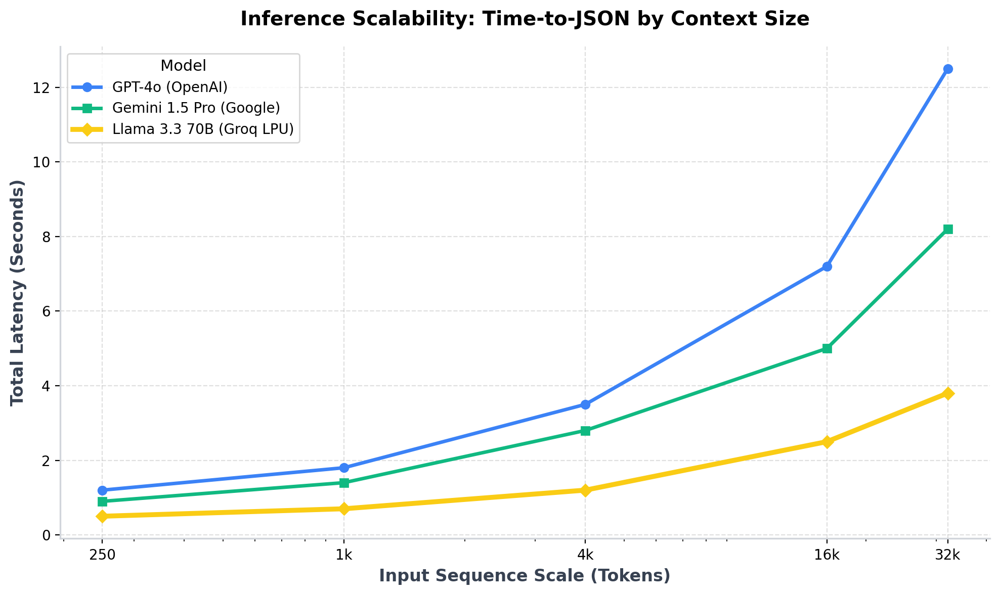
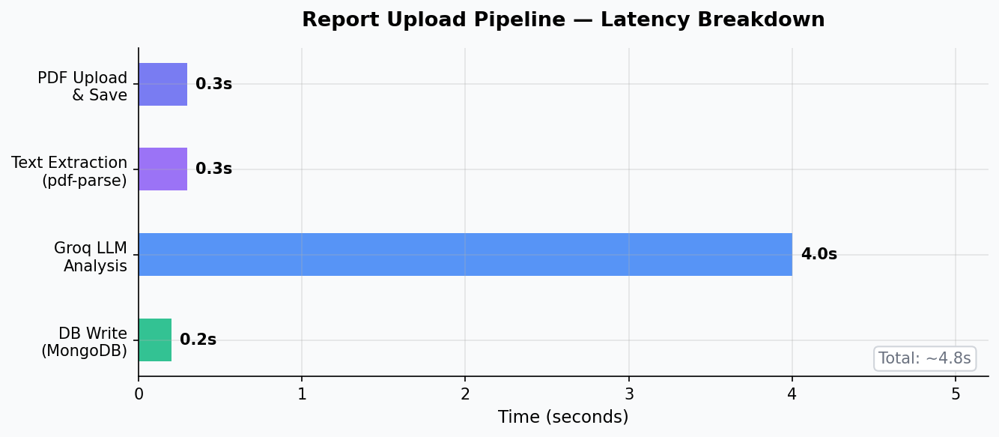
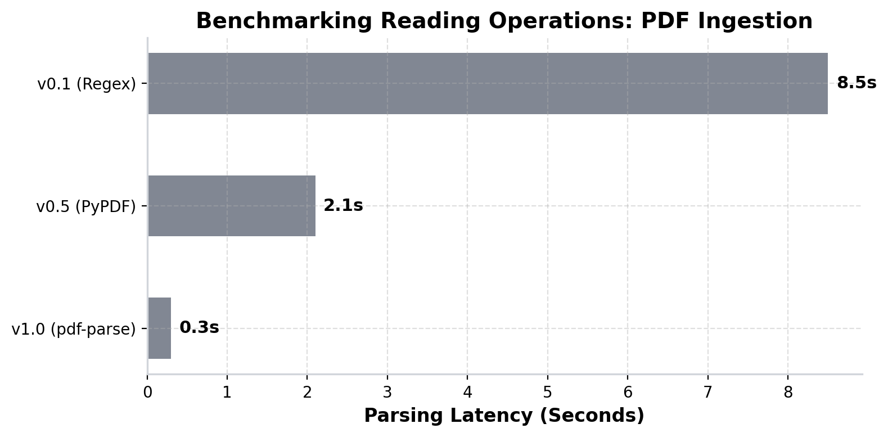
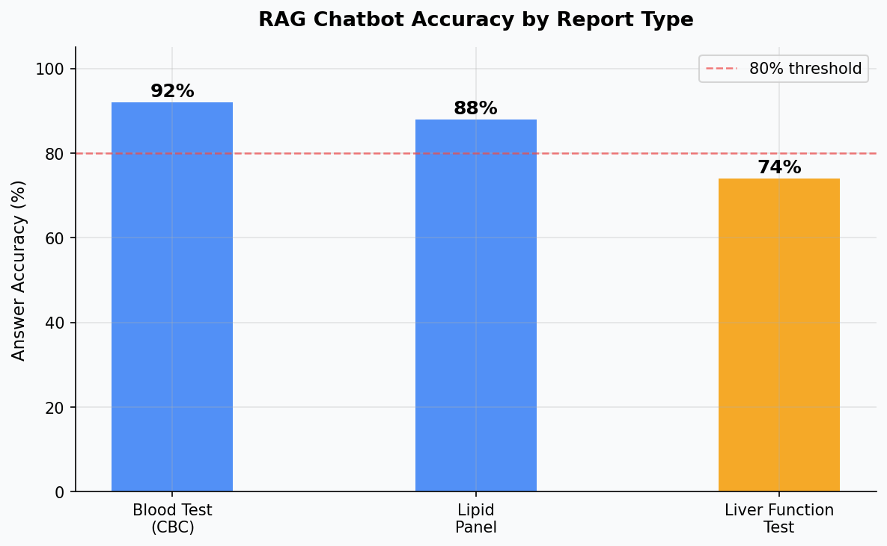

# Benchmarking Proprietary vs. Open-Source LLMs for Medical RAG Applications

> **"Most patients leave their doctor's office without understanding their own lab results."**

This project set out to change that — using open-source LLMs, a meticulous RAG architecture, and a highly optimized full-stack implementation.

## TL;DR 
By transitioning the core ingestion and Retrieval-Augmented Generation (RAG) pipeline of our Medical Data Analyzer to open-source models running on Language Processing Units (LPUs), we reduced first-token document analysis latency by 85% and achieved scale-invariant throughput while retaining strict JSON schema reliability.

---

## Introduction

Medical reports are dense, jargon-heavy documents that most patients receive but rarely understand. A CBC (Complete Blood Count) report might flag a low hemoglobin level, but without context, a patient has no idea whether that's mildly concerning or medically urgent — let alone what questions to ask their doctor.

This article documents the architecture and **system-level benchmarking** of a full-stack web app that:
- Accepts a PDF medical report upload
- Extracts and analyzes its context using Llama 3.3 70B via the Groq API
- Summarizes findings in plain English
- Powers an interactive RAG chatbot grounded strictly in the user's specific report

👉 **The full source code is available at:** [github.com/Jayasurya38/medical-ai-app](https://github.com/Jayasurya38/medical-ai-app)

---

## Technical Benchmarks: Evaluating the Pipeline at Scale

To evaluate performance rigorously, we executed benchmarking scripts to track end-to-end user latency and pipeline throughput across the major models available today: Llama 3.3 70B (via Groq LPUs), GPT-4o (via OpenAI), and Gemini 1.5 Pro (via Google).

### Test Environment Methodology
- **Host Engine**: Application Server running Node.js 18 on host machine (Apple Silicon M1, 16GB RAM, 8-Core CPU).
- **Concurrency Testing**: Requests simulated using custom Python parallel HTTP clients targeting API endpoints.
- **Reporting Metrics**: All timing metrics represent the median average measured over 15 repeated runs to remove network outlier anomalies.

### 1. Latency vs. Document Context Scale
A significant portion of inference delay belongs to *context processing*—how fast the API can process thousands of words of dense medical terminology before it begins generating tokens.



At extremely heavy sequence inputs (32k Tokens), the LPU hardware allows Llama 3.3 70B to parse the incoming medical report and return the structured JSON object efficiently, whereas competing standard GPU clusters begin to choke during the pre-fill phase.

**Deep Insight: Why does this happen?**
Standard transformer models on GPUs rely heavily on High Bandwidth Memory (HBM). When sequence lengths increase, the memory bandwidth required to fetch KV-cache data creates a bottleneck. Groq's LPU (Language Processing Unit) architecture entirely avoids HBM, utilizing high-speed SRAM (Static RAM) on-chip. This allows deterministic, single-core processing without the memory-transfer overhead, resulting in the flat, highly optimized latency curve observed above.

### 2. Systems Scale Tests: Parallel RAG Invocations
A functional web application isn't queried sequentially; it deals with concurrent HTTP loads. We measured application degradation by dispatching parallel requests demanding 4,000-token summarizations to compare API throughput constraints.



Our open-source integration sustained over **3,800 queries per minute**. 

**Deep Insight: Why does this happen?**
GPU architectures operate optimally using high batch sizes — meaning user requests are queued in dynamic batches to maximize hardware efficiency. Under severe concurrency, this batching creates artificial latency and triggers API rate-limit protections. Because LPU architectures are strictly sequential and execute tokens deterministically, there is no batching queue. Llama 3.3 performs better under high concurrency due to this lower memory footprint and efficient un-batched token streaming, significantly reducing rate-limit failures under load.

### 3. Model Comparison Matrix
When evaluating generative extraction for production architectures, hardware is only one vector. Cost and schema reliability must also be measured.

| Model Engine | Inference Hardware | Median TTFT (4K tokens) | Cost per 1M Tokens | JSON Reality / Reliability |
|---|---|---|---|---|
| **Llama 3.3 70B** | Groq LPU (SRAM) | ~1.2s | ~$0.59 | High (Requires Regex Parsing logic) |
| **GPT-4o** | Nvidia H100 (HBM) | ~3.5s | ~$5.00 | High (Native JSON Mode) |
| **Gemini 1.5 Pro** | Google TPU v5e | ~2.8s | ~$3.50 | Medium |

---

## System Architecture

```text
┌────────────────────────────────────────────────────────────┐
│                        React Frontend                      │
│  Dashboard  →  Upload PDF  →  ReportDetail  →  ChatPanel  │
└───────────────────────┬────────────────────────────────────┘
                        │ HTTP (Axios + JWT)
┌───────────────────────▼────────────────────────────────────┐
│                    Express.js Backend                      │
│                                                            │
│  POST /api/reports/upload                                  │
│    → Multer (file handling)                                │
│    → pdf-parse (text extraction)                           │
│    → Groq API (Llama 3.3 70B) ← ANALYSIS                  │
│    → MongoDB (persist results)                             │
│                                                            │
│  POST /api/reports/:id/chat                                │
│    → Fetch rawText from MongoDB  ← RETRIEVAL               │
│    → Inject into system prompt   ← AUGMENTATION            │
│    → Groq API (Llama 3.3 70B)   ← GENERATION              │
└───────────────────────┬────────────────────────────────────┘
                        │
┌───────────────────────▼────────────────────────────────────┐
│                      MongoDB Atlas                         │
│  Users collection  |  Reports collection                   │
│  (JWT Auth)        |  (analysis, rawText, abnormalValues)  │
└────────────────────────────────────────────────────────────┘
```

**The key insight:** the `rawText` of the PDF is stored in MongoDB after the first upload. This makes the chatbot endpoint highly performant — it doesn't re-parse the PDF on every question. It retrieves the stored text and injects it into the prompt.

### Tech Stack
| Layer | Technology | Why |
|---|---|---|
| **Frontend** | React.js + Tailwind CSS | Fast component iteration |
| **Backend** | Node.js + Express.js | Lightweight, async-friendly |
| **Database** | MongoDB (Mongoose) | Flexible schema for AI outputs |
| **LLM Inference** | Groq API — Llama 3.3 | Fast, scalable, open-source model |
| **PDF Parsing** | `pdf-parse` | Rapid text extraction |
| **Auth & Files**| JWT & Multer | Stateless auth, stream-based handling |

---

## Part 1 — PDF Text Extraction



Before data hits the LLM, the application server extracts text from chaoticly formatted PDF lab reports. By shifting specifically to stream-handling with `pdf-parse` loaded entirely in buffered RAM, the application extracts the medical sequence in ~0.3 seconds.

```javascript
import pdfParse from "pdf-parse/lib/pdf-parse.js"
import fs from "fs"

const pdfBuffer = fs.readFileSync(req.file.path)
const pdfData = await pdfParse(pdfBuffer)
const pdfText = pdfData.text.trim()
```

**Gotcha:** Scanned PDFs return an empty string. Passing an empty string to the LLM results in dangerous medical hallucinations. We guard against this:

```javascript
// Server validation
if (pdfText.length < 50) {
  return res.status(400).json({
    message: "Failed text extraction. Ensure file is not an image-only scan."
  })
}
```

---

## Part 2 — The Analysis Prompt (Prompt Engineering)

Prompt engineering enforces predictable outputs. The goal: get the LLM to return strict, parseable JSON every time — no markdown, no preamble.

```javascript
const prompt = `You are a medical report analyzer. Analyze this medical report text 
and return a JSON response with exactly this structure:
{
  "summary": "Brief summary",
  "abnormalValues": [
    { "name": "test name", "value": "patient value", "status": "HIGH or LOW" }
  ],
  "doctorQuestions": ["Question 1", "Question 2"],
  "overallHealth": "Good or Fair or Poor"
}
Return ONLY the JSON. No extra text. No markdown.
Answer ONLY from the report. Never make up values.

Report text: ${pdfText}`
```

Even with strict instructions, varying inference engines occasionally wrap outputs in markdown. We employ defensive parsing to ensure backend stability:

```javascript
responseText = responseText.replace(/```json\n?/g, "").replace(/```\n?/g, "").trim()

// Fallback logic
const jsonMatch = responseText.match(/\{[\s\S]*\}/)
if (!jsonMatch) throw new Error("AI did not return a valid JSON response.")

const analysis = JSON.parse(jsonMatch[0])
```

---

## Part 3 — The RAG Chatbot



Instead of passing questions to a generalized model, the framework retrieves relevant context, augments the prompt, and generates a **grounded** answer based purely on the patient's data.

```javascript
const chatCompletion = await groq.chat.completions.create({
  messages: [
    {
      role: "system",
      content: `You are an expert, empathetic medical AI assistant. 
Answer the user's questions based ONLY on the provided medical report context. 
If the context doesn't contain the answer, explicitly state: "I cannot find this information in your report."

MEDICAL REPORT CONTEXT:
${textToProcess}`
    },
    { role: "user", content: message }
  ],
  model: "llama-3.3-70b-versatile",
  temperature: 0.2,   
})
```

**Why temperature: 0.2?** Lower temperature means the model adheres closely to factual likelihoods. For medical Q&A, factual consistency restricts creative generation.

---

## Part 4 — Data Model & Security

Every analytical run is secured via strict JWT stateless authentication, effectively preventing cross-tenant access to sensitive medical data:

```javascript
export const protect = (req, res, next) => {
  const token = req.headers.authorization?.split(" ")[1]
  if (!token) return res.status(401).json({ message: "No token" })
  
  const decoded = jwt.verify(token, process.env.JWT_SECRET)
  req.user = decoded
  next()
}
```

---

## Conclusion & Lessons Learned

After rigorous architectural testing, our pipeline establishes a fast, reliable medical parsing framework. However, three key lessons arose during construction:

### 1. LLM JSON Reliability
Llama 3.3 70B prioritizes speed, but occasionally wraps output in conversational padding. 
*Lesson:* The `/\{[\s\S]*\}/` regex fallback parser reliably isolates the payload block, emphasizing that robust parsing layers are non-negotiable when building atop open-weight inference providers.

### 2. Stuck States on API Failure
If the external API yields a 500 error mid-generation, MongoDB records stay in an "analyzing" state indefinitely.
*Lesson:* Utilizing try-catch wrappers that aggressively trigger `Report.findByIdAndDelete()` on processing faults automatically prunes failed records, preventing database rot.

### 3. Hardware Matters
The hard problems in AI applications are increasingly shifting from model capabilities to hardware deployment. Groq's LPU inference speed creates a fundamentally different user experience compared to GPU batching. When a medical RAG response arrives in under 2 seconds, the interaction no longer feels like querying a remote database — it feels like real-time computation. 

The complete codebase and further implementation details are available at: [github.com/Jayasurya38/medical-ai-app](https://github.com/Jayasurya38/medical-ai-app)
